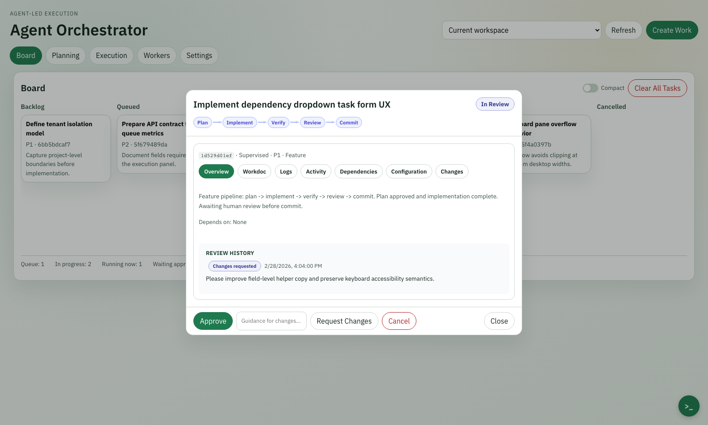

# Agent Orchestrator

Agent Orchestrator is a local orchestration control center for AI-assisted software delivery.
It gives you a task board, execution controls, review gates, and worker management in one place.

Orchestrator autonomously plans and executes work across repositories — parallelizing independent changes, sequencing dependencies, and resolving conflicts as delivery progresses.
Execution runs under enforced coding standards and a continuous review-and-fix cycle, producing resilient, merge-ready results instead of fragile one-pass output.

<!-- Screenshot may not reflect the latest UI. Regenerate with: npm --prefix web run screenshot:homepage -->


## What You Can Do

- Manage a full task lifecycle on a kanban board (`backlog` → `queued` → `in_progress` → `in_review` → `done`, plus `blocked` and `cancelled`).
- Import PRDs into executable task graphs with dependency edges.
- Draft, refine, and commit task plans with full revision lineage before execution.
- Run Quick Actions for one-off work and optionally promote results into tasks.
- Control orchestrator execution (`pause`, `resume`, `drain`, `stop`).
- Choose a Human-in-the-Loop (HITL) mode per task: **Autopilot**, **Supervised**, **Collaborative**, or **Review Only**.
- View execution summaries with per-step status, review findings, and commit SHAs in the task detail modal.
- Manage worker providers (Codex, Claude, Ollama) and configure step-to-provider routing.
- Observe real-time updates across board, execution, and task detail via WebSocket.

## Quick Start

### 1. Start the backend

```bash
python -m pip install -e ".[server]"
agent-orchestrator server
```

Backend runs at `http://localhost:8080` by default.

### 2. Start the web UI

```bash
npm --prefix web install
npm --prefix web run dev
```

Frontend runs at `http://localhost:3000` by default (proxies `/api` to the backend).

## Navigation

| Tab | Purpose |
|---|---|
| **Board** | Kanban columns with task cards, inline detail/edit, and task explorer |
| **Planning** | Plan creation, iterative refinement, and revision history per task |
| **Execution** | Orchestrator status, queue depth, execution batches, pause/resume/drain/stop controls |
| **Workers** | Provider health (Codex/Claude/Ollama), step-to-provider routing table, active task monitoring |
| **Settings** | Project selector, concurrency, auto-deps, quality gates, worker config, project commands |

## Core Workflows

### Create and run a task

1. Open **Create Work** → **Create Task**.
2. Fill task fields (title, type, priority, description).
3. Transition to `queued` or run from task detail.
4. Track progress in **Execution**.
5. Review from the task detail modal when it reaches `in_review`.

### Import a PRD into tasks

1. Open **Create Work** → **Import PRD**.
2. Paste PRD content and preview generated tasks/dependencies.
3. Commit the import job.
4. Review and execute created tasks from the board.

### Run a quick action

1. Open **Create Work** → **Quick Action**.
2. Submit a prompt or command intent.
3. Inspect result details.
4. Promote to a task if you want board-tracked follow-up work.

## Task Lifecycle

```
backlog → queued → in_progress → in_review → done
                        ↓               ↓
                     blocked       (request changes → queued)
```

Tasks support dependency graphs (validated for cycles), parallel execution with configurable concurrency, and review cycles with severity-based findings.

## Pipeline Templates

Tasks execute through pipeline templates matched to their type:

| Template | Steps |
|---|---|
| feature | plan → implement → verify → review → commit |
| bug_fix | reproduce → diagnose → implement → verify → review → commit |
| refactor | analyze → plan → implement → verify → review → commit |
| hotfix | implement → verify → review → commit |
| docs | analyze → implement → review → commit |
| test | analyze → implement → verify → review → commit |
| research | gather → analyze → summarize → report |
| plan_only | plan |

Additional templates: `repo_review`, `security_audit`, `review`, `performance`, `spike`, `chore`.

## API and CLI

- REST/WebSocket reference: `docs/API_REFERENCE.md`
- CLI reference: `docs/CLI_REFERENCE.md`
- End-to-end usage guide: `docs/USER_GUIDE.md`

API base path: `/api`
WebSocket endpoint: `/ws`

### CLI quick reference

```bash
# Start server
agent-orchestrator server --project-dir /path/to/repo

# Task management
agent-orchestrator task create "My task" --priority P1 --task-type feature
agent-orchestrator task list --status queued
agent-orchestrator task run <task_id>

# Quick action
agent-orchestrator quick-action "fix the lint errors in src/utils.py"

# Orchestrator control
agent-orchestrator orchestrator status
agent-orchestrator orchestrator control pause

# Project management
agent-orchestrator project pin /path/to/repo
agent-orchestrator project list
agent-orchestrator project unpin <project_id>
```

## Configuration and Runtime Data

Runtime state is stored in the selected project directory:
- `.agent_orchestrator/tasks.yaml`
- `.agent_orchestrator/runs.yaml`
- `.agent_orchestrator/review_cycles.yaml`
- `.agent_orchestrator/agents.yaml`
- `.agent_orchestrator/quick_actions.yaml`
- `.agent_orchestrator/plan_revisions.yaml`
- `.agent_orchestrator/plan_refine_jobs.yaml`
- `.agent_orchestrator/events.jsonl`
- `.agent_orchestrator/config.yaml`

Primary configurable areas:
- `orchestrator` (concurrency, auto deps, review attempts)
- `agent_routing` (default role, task-type role routing, provider overrides)
- `defaults.quality_gate`
- `workers` (default provider, routing, providers)
- `project.commands` (per-language test, lint, typecheck, format commands)

Claude provider example:
```json
{
  "workers": {
    "default": "claude",
    "providers": {
      "claude": {
        "type": "claude",
        "command": "claude -p",
        "model": "sonnet",
        "reasoning_effort": "medium"
      }
    }
  }
}
```

Notes:
- Claude CLI must be installed and authenticated locally.
- Reasoning effort flags are only passed when supported by your installed CLI version.

## Verify Locally

```bash
# Backend tests
pytest

# Optional integration tests (skipped by default and in CI)
AGENT_ORCHESTRATOR_RUN_INTEGRATION=1 pytest tests/test_integration_worker_model_fallback.py
AGENT_ORCHESTRATOR_RUN_INTEGRATION=1 pytest tests/test_integration_claude_provider.py

# Frontend checks
npm --prefix web run check

# Frontend smoke e2e
npm --prefix web run e2e:smoke
```

## Documentation

- `docs/README.md`: documentation index
- `docs/USER_GUIDE.md`: complete user guide
- `docs/API_REFERENCE.md`: endpoint and WebSocket reference
- `docs/CLI_REFERENCE.md`: CLI commands and options
- `web/README.md`: frontend-specific setup and test workflow
- `example/README.md`: sample project walkthrough

## License

MIT
