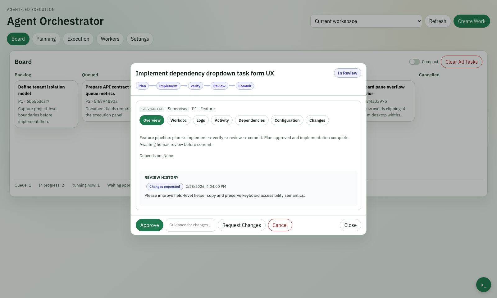

# Agent Orchestrator

Agent Orchestrator is a local control center for AI-assisted software delivery, with task management, execution controls, review gates, and worker management in one place.

It coordinates work across repositories by sequencing dependencies, parallelizing safe independent tasks, and managing integration as delivery progresses.

You keep task prompts concise; the orchestrator handles step-specific guidance, pipeline structure, and quality controls to produce resilient, merge-ready outcomes without custom prompt packs.

<!-- Screenshot may not reflect the latest UI. Regenerate with: npm --prefix web run screenshot:homepage -->


## What You Can Do

### Deliver high-quality code with intent-specific pipelines
- Write prompts as usual: short, concise, clear intent.
- Select or let the orchestrator route work through the most suitable built-in pipeline (for example `feature`, `bug_fix`, `refactor`, `hotfix`, `docs`, `test`).
- Each pipeline step applies step-specific guidance (`plan/analyze`, `implement`, `verify`, `review`, `commit`) to produce higher-quality outcomes than single-pass prompting.
- Delivery pipelines run review-and-fix loops until findings are within your configured tolerance thresholds.
- Full PRDs can be imported and automatically decomposed into dependency-aware execution batches.

### Enforce quality and governance
- Choose a Human-in-the-Loop mode per task: **Autopilot**, **Supervised**, or **Review Only**.
- **Autopilot** runs end-to-end with no approvals.
- **Supervised** requires plan/decomposition approval and human review before commit.
- **Review Only** skips planning gates, pauses for human review before commit, and adds a final done gate for non-commit pipelines.
- Configure severity thresholds (`critical`, `high`, `medium`, `low`) globally or per task to control pass/fail tolerance.
- Draft, refine, and commit plan revisions with full lineage before implementation when needed.

### Scale execution across repositories
- Run independent tasks in parallel, with automatic isolated git worktree provisioning for same-repo execution.
- Automatically integrate branches and trigger conflict-resolution flows when collisions occur.
- Route pipeline steps across providers (Codex, Claude, Ollama) with configurable step-to-provider mapping.
- Use the embedded interactive terminal to intervene manually without leaving the orchestrator UI.

### Audit and trace every task
- Track full task history from prompt to completion: task state transitions, plan/workdoc revisions, review decisions, and gate approvals.
- Every task produces a persistent workdoc, plus per-step runtime evidence (`stdout.log`, `stderr.log`, `progress.json`) and event timeline.
- Inspect execution summaries, step outcomes, review findings, total runtime, and commit SHAs in task detail.

## Quick Start

### 1. Start the backend

```bash
python -m pip install -e ".[server]"
agent-orchestrator server
```

Backend runs at `http://localhost:8080` by default.

### 2. Start the web UI

```bash
npm --prefix web install
npm --prefix web run dev
```

Frontend runs at `http://localhost:3000` by default (proxies `/api` to the backend).

## Navigation

| Tab | Purpose |
|---|---|
| **Board** | Kanban columns with task cards, inline detail/edit, and task explorer |
| **Planning** | Plan creation, iterative refinement, and revision history per task |
| **Execution** | Orchestrator status, queue depth, execution batches, pause/resume/drain/stop controls |
| **Workers** | Provider health (Codex/Claude/Ollama), step-to-provider routing table, active task monitoring |
| **Settings** | Project selector, concurrency, auto-deps, quality gates, worker config, project commands |

## Core Workflows

### Create and run a task

1. Open **Create Work** → **Create Task**.
2. Fill task fields (title, type, priority, description). Use `auto` type when you want the orchestrator to select the best pipeline.
3. Transition to `queued` or run from task detail.
4. Track progress in **Execution**.
5. Review from the task detail modal when it reaches `in_review`.

### Import a PRD into tasks

1. Open **Create Work** → **Import PRD**.
2. Paste PRD content and preview generated tasks/dependencies.
3. Commit the import job.
4. Review and execute created tasks from the board.

### Use embedded terminal

1. Open **Create Work** → **Terminal**.
2. Start or attach to the active project terminal session.
3. Run commands interactively with live output and ANSI support.
4. Stop the session from the UI when done.

## Task Lifecycle

```
backlog → queued → in_progress → in_review → done
                        ↓               ↓
                     blocked       (request changes → queued)
```

Tasks support dependency graphs (validated for cycles), automatic dependency inference, parallel execution with configurable concurrency, merge-aware completion for worktree runs, and review cycles with severity-based findings.

## Pipeline Templates

Tasks execute through pipeline templates matched to their type. These templates are designed for code quality and delivery reliability, with specialized step flows by task intent:

| Pipeline | Use case / intent | Steps / flow |
|---|---|---|
| `feature` | Standard feature delivery with planning, quality checks, and commit. | `plan → implement → verify → review → commit` |
| `bug_fix` | Reproduce and diagnose a bug before fixing and validating. | `reproduce → diagnose → implement → verify → review → commit` |
| `refactor` | Structured refactor with analysis and explicit plan first. | `analyze → plan → implement → verify → review → commit` |
| `hotfix` | Fast-path production fix without dedicated diagnosis step. | `implement → verify → review → commit` |
| `docs` | Documentation updates with quality verification and review. | `analyze → implement → verify → review → commit` |
| `test` | Add/adjust tests with validation and review before commit. | `analyze → implement → verify → review → commit` |
| `research` | Investigate and produce a report (no commit step). | `analyze → report` |
| `repo_review` | Assess repository state, form an initiative plan, then generate execution tasks. | `analyze → initiative_plan → generate_tasks` |
| `security_audit` | Scan dependencies/code for security issues, report, and emit remediation tasks. | `scan_deps → scan_code → report → generate_tasks` |
| `review` | Analyze and review existing changes, then produce a report. | `analyze → review → report` |
| `performance` | Profile baseline, optimize, benchmark, then review and commit. | `profile → plan → implement → benchmark → review → commit` |
| `spike` | Timeboxed exploratory prototype and recommendation report. | `analyze → prototype → report` |
| `chore` | Mechanical maintenance work with verification and commit. | `implement → verify → commit` |
| `plan_only` | Initiative-level planning and decomposition into executable tasks. | `analyze → initiative_plan → generate_tasks` |
| `verify_only` | Run checks and report status without making code changes. | `verify → report` |

## API and CLI

- REST/WebSocket reference: `docs/API_REFERENCE.md`
- CLI reference: `docs/CLI_REFERENCE.md`
- End-to-end usage guide: `docs/USER_GUIDE.md`

API base path: `/api`
WebSocket endpoint: `/ws`

### CLI quick reference

```bash
# Start server
agent-orchestrator server --project-dir /path/to/repo

# Task management
agent-orchestrator task create "My task" --priority P1 --task-type feature
agent-orchestrator task list --status queued
agent-orchestrator task run <task_id>

# Orchestrator control
agent-orchestrator orchestrator status
agent-orchestrator orchestrator control pause

# Project management
agent-orchestrator project pin /path/to/repo
agent-orchestrator project list
agent-orchestrator project unpin <project_id>
```

## Configuration and Runtime Data

Runtime state is stored in the selected project directory:
- `.agent_orchestrator/runtime.db` (canonical runtime state store)
- `.agent_orchestrator/workdocs/<task_id>.md` (canonical task workdocs synced with per-worktree `.workdoc.md`)
- `.agent_orchestrator_archive/state_<timestamp>/` (archived runtime snapshots on clear)

Execution metadata also records per-step log artifact locations (for example `stdout.log`, `stderr.log`, and `progress.json`) in task run details.

Primary configurable areas:
- `orchestrator` (concurrency, auto deps, review attempts)
- `agent_routing` (default role, task-type role routing, provider overrides)
- `defaults.quality_gate`
- `workers` (default provider, routing, providers)
- `project.commands` (per-language test, lint, typecheck, format commands)
- `project.prompt_injections` (per-step additive prompt text appended to worker instructions)

Claude provider example:
```json
{
  "workers": {
    "default": "claude",
    "providers": {
      "claude": {
        "type": "claude",
        "command": "claude -p",
        "model": "sonnet",
        "reasoning_effort": "medium"
      }
    }
  }
}
```

Notes:
- Claude CLI must be installed and authenticated locally.
- Reasoning effort flags are only passed when supported by your installed CLI version.

## Verify Locally

```bash
# Backend tests
pytest

# Optional integration tests (skipped by default and in CI)
AGENT_ORCHESTRATOR_RUN_INTEGRATION=1 pytest tests/test_integration_worker_model_fallback.py
AGENT_ORCHESTRATOR_RUN_INTEGRATION=1 pytest tests/test_integration_claude_provider.py

# Frontend checks
npm --prefix web run check

# Frontend smoke e2e
npm --prefix web run e2e:smoke
```

Local pushes are gated by `.githooks/pre-push` and run:
- `.venv/bin/ruff check .`
- `.venv/bin/pytest -q`
- `npm --prefix web run check`

Enable hooks once per clone:
```bash
git config core.hooksPath .githooks
```

## Documentation

- `docs/README.md`: documentation index
- `docs/USER_GUIDE.md`: complete user guide
- `docs/API_REFERENCE.md`: endpoint and WebSocket reference
- `docs/CLI_REFERENCE.md`: CLI commands and options
- `web/README.md`: frontend-specific setup and test workflow
- `example/README.md`: sample project walkthrough

## License

MIT
